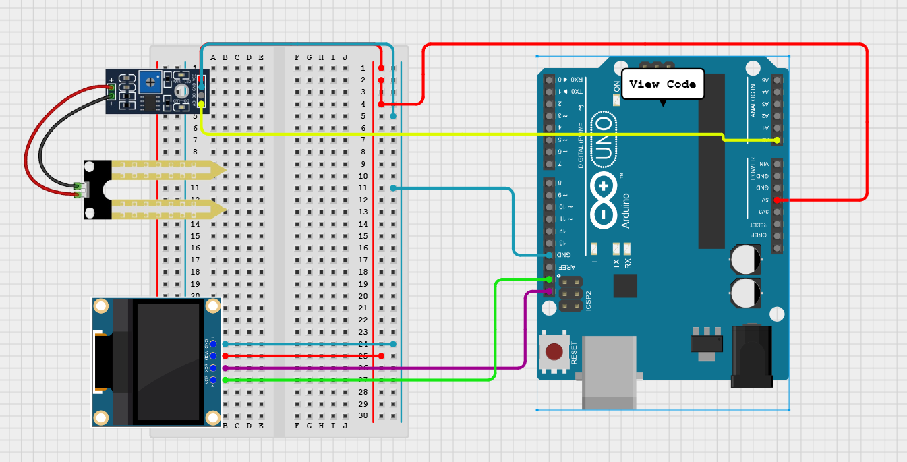

# Projeto de Monitoramento de Umidade do Solo

Este projeto utiliza um sensor de umidade do solo e um display OLED para monitorar e exibir os níveis de umidade em tempo real. O sistema é controlado por um Arduino UNO, que lê os dados do sensor e os apresenta no display.

## Componentes Utilizados

- **Arduino UNO**
- **Sensor de Umidade do Solo**
- **Display OLED 0.96"**

## Funcionamento

1. O sensor de umidade do solo mede a umidade do solo e envia os dados para o Arduino.
2. O Arduino processa os dados e os exibe no display OLED.
3. O valor da umidade é atualizado a cada segundo.

## Esquema do Circuito

